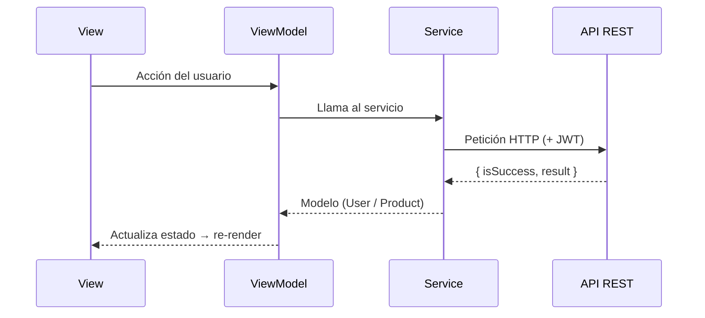

# Arquitectura MVVM — UFood

Documentación técnica del frontend móvil. Para una visión general del proyecto, consulta el [README](./README.md).

## Descripción general

La aplicación sigue el patrón **MVVM (Model-View-ViewModel)** combinado con patrones de diseño adicionales (Singleton, Repository, Interceptor) para favorecer la escalabilidad y el mantenimiento.



## Estructura del proyecto

```text
UFOOD/
├── src/
│   ├── config/           # Configuración centralizada (app.config.js)
│   ├── models/           # User.model.js, Product.model.js
│   ├── services/         # Http, Auth, Product, Storage, Datadog
│   ├── viewmodels/       # Auth.viewmodel.js, Product.viewmodel.js, ...
│   ├── views/            # Pantallas
│   │   ├── LoginScreen.js
│   │   ├── RegisterScreen.js
│   │   ├── HomeScreen.js
│   │   ├── ProductsListScreen.js
│   │   ├── ProductFormScreen.js
│   │   ├── ProfileScreen.js
│   │   ├── AdminHomeScreen.js
│   │   ├── AdminUsersScreen.js
│   │   ├── AdminProductsScreen.js
│   │   └── AdminProductDetailScreen.js
│   ├── navigation/       # AppNavigator.js, NavigationTracker.js
│   ├── utils/            # Validaciones y formato
│   └── constants/        # Colores
├── assets/
├── docs/images/          # Capturas del README
├── App.js
└── package.json
```

## Capas

| Capa | Responsabilidad | Ejemplos |
|---|---|---|
| **Model** | Representa los datos, los transforma y los valida | `User.model.js`, `Product.model.js` |
| **View** | Renderiza la interfaz y delega las acciones | Pantallas de `views/` |
| **ViewModel** | Estado y lógica de presentación mediante hooks | `Auth.viewmodel.js`, `Product.viewmodel.js` |
| **Service** | Acceso a la API y al almacenamiento local | `Http`, `Auth`, `Product`, `Storage` |

## Patrones de diseño

### 1. MVVM

**Propósito:** separar la lógica de presentación de la de datos.

- **Model:** clases con los datos y su validación.
- **View:** componentes React Native que solo renderizan.
- **ViewModel:** hooks personalizados que manejan el estado de cada pantalla.

### 2. Singleton

**Propósito:** garantizar una única instancia de los servicios.

```javascript
class HttpService {
  constructor() {
    if (HttpService.instance) {
      return HttpService.instance;
    }
    HttpService.instance = this;
  }
}
```

Aplicado en `Storage.service.js`, `Http.service.js`, `Auth.service.js` y `Product.service.js`.

### 3. Repository

Los servicios actúan como repositorios: encapsulan el acceso a la API y transforman las respuestas en modelos. Cambiar la fuente de datos solo requiere modificar esta capa.

### 4. Interceptor

**Propósito:** modificar peticiones y respuestas de forma centralizada.

```javascript
httpService.addRequestInterceptor(async (config) => {
  const isAuthRoute = config.url.includes('/login') || config.url.includes('/register');

  if (!isAuthRoute) {
    const token = await storageService.getItem(CONFIG.STORAGE_KEYS.USER_TOKEN);
    if (token) {
      config.headers = { ...config.headers, Authorization: `Bearer ${token}` };
    }
  }
  return config;
});
```

- **Request:** agrega el token JWT, excepto en las rutas de login y registro.
- **Response:** actualiza la marca de última actividad de la sesión tras cada respuesta exitosa.

### 5. Observer (mediante hooks)

Los ViewModels exponen estado con `useState` y `useCallback`. Cuando cambia, las Views se vuelven a renderizar automáticamente.

### 6. Factory (implícito)

Los modelos se crean con métodos estáticos que encapsulan la transformación:

```javascript
static fromStorage(jsonString) {
  try {
    return new User(JSON.parse(jsonString));
  } catch (error) {
    return null;
  }
}
```

### 7. Strategy (validación)

Cada modelo expone `validate(data)`, que aplica reglas por campo y devuelve `{ isValid, errors }`. Las reglas (patrones, longitudes) viven en `CONFIG.VALIDATION`.

## Flujo de ejemplo: inicio de sesión

> Los fragmentos de View y ViewModel son ilustrativos y están simplificados.

```javascript
// 1. View dispara la acción
const handleLogin = async () => {
  const result = await authViewModel.login(email, password);
  if (result.success) {
    navigation.navigate(result.user.isAdmin ? 'AdminHome' : 'Home');
  } else {
    Alert.alert('Error', result.error);
  }
};

// 2. Service ejecuta la lógica
async login(email, password) {
  await this._checkLoginLockout();

  const response = await httpService.post(
    `${CONFIG.API.AUTH_BASE_URL}/login`,
    { email, password }
  );
  if (!response.isSuccess || !response.result) {
    throw new Error(response.message || 'Credenciales incorrectas');
  }

  const { user: userData, token } = response.result;
  const user = new User(userData);
  await this._saveSession(token, user);
  return { success: true, user, token };
}

// 3. Model transforma los datos
class User {
  constructor(data) {
    this.id = data.id || data.userId || null;
    this.roles = Array.isArray(data.roles) ? data.roles : [];
  }
  get isAdmin() {
    return this.roles.includes(CONFIG.ROLES.ADMIN);
  }
}
```

## Control de acceso por rol

`User.isAdmin` indica si el arreglo `roles` incluye `ADMIN`. Al iniciar la app, `AppNavigator` verifica la sesión y redirige a `AdminHome` o `Home` según ese valor.

Este control en el cliente define qué interfaz se muestra. La autorización real de cada operación corresponde al backend.

## Seguridad en el cliente

| Medida | Detalle |
|---|---|
| **Almacenamiento local** | Los datos de sesión se codifican en base64 antes de guardarse en AsyncStorage. Es ofuscación, no cifrado. Las claves usan el prefijo `@ufood_`. |
| **Expiración de sesión** | 1 hora de inactividad. Se verifica cada 60 segundos y al abrir la app; al vencer se cierra la sesión. |
| **Intentos fallidos** | Tras 5 intentos fallidos de login se bloquea el acceso durante 15 minutos. Es un control del cliente, complementario al del servidor. |
| **Validación** | Los modelos validan en el cliente; el servidor también valida y la app muestra sus mensajes de error. |
| **Autenticación** | Token JWT enviado como `Bearer` mediante interceptor. |

## Monitoreo

`Datadog.service.js` registra eventos de uso, errores y rendimiento. `NavigationTracker` envuelve el navegador para capturar las vistas de pantalla y su duración. El detalle de los eventos está en el [README](./README.md#monitoreo-con-datadog).

## Pruebas

La arquitectura permite probar cada capa de forma independiente, pero **el proyecto aún no incluye pruebas automatizadas**. Ejemplo de lo planteado:

```javascript
test('User.validate() rechaza email inválido', () => {
  const result = User.validate({ email: 'invalid' });
  expect(result.isValid).toBe(false);
});
```

## Buenas prácticas aplicadas

- **Nomenclatura:** `Entity.model.js`, `Service.service.js`, `Feature.viewmodel.js`, `FeatureScreen.js`.
- **Estado inmutable:** `setProducts(prev => [...prev, newProduct])`; nunca mutar el arreglo directamente.
- **Separación de responsabilidades:** las Views solo renderizan, los ViewModels manejan la presentación, los Services la comunicación con datos y los Models la validación.
- **Errores:** los servicios capturan el error técnico y lanzan un mensaje claro para el usuario.

## Escalabilidad

1. **Nueva funcionalidad:** crear Model + Service + ViewModel + View.
2. **Cambiar el backend:** modificar solo los Services y la configuración.
3. **Cambiar la interfaz:** modificar solo las Views.
4. **Trabajo en equipo:** cada capa tiene responsabilidades claras.

## Próximos pasos

- [ ] Pruebas unitarias
- [ ] Refresh token
- [ ] Almacenar el token con `expo-secure-store` en lugar de AsyncStorage
- [ ] Manejo offline
- [ ] Notificaciones push
- [ ] Modo oscuro
- [ ] Caché de imágenes
- [ ] Internacionalización (i18n)

## Referencias

- [MVVM Pattern](https://en.wikipedia.org/wiki/Model%E2%80%93view%E2%80%93viewmodel)
- [React Native Performance](https://reactnative.dev/docs/performance)
- [The Clean Architecture](https://blog.cleancoder.com/uncle-bob/2012/08/13/the-clean-architecture.html)