# UFood — Marketplace móvil de alimentos


Aplicación móvil que conecta a estudiantes universitarios con vendedores de alimentos dentro y cerca del campus. Los estudiantes descubren productos y platillos, los filtran por categoría y contactan al vendedor directamente por WhatsApp. Desarrollada con **React Native + Expo** y una arquitectura **MVVM** preparada para consumir servicios REST.

<p align="center">
  
</p>

**🎨 Prototipo:** [Figma](https://www.figma.com/proto/RSHdXW03TWzHwBnlzr1H6I/Proyecto-Unifood?node-id=203-91&t=YW8KWwt7WpPUUCtV-1&scaling=scale-down&content-scaling=fixed&page-id=92%3A2089) &nbsp;·&nbsp; **🌐 Landing page:** [matrark.github.io/ufood-landing](https://matrark.github.io/ufood-landing/)

> **Proyecto académico en equipo (2025).** El backend se desplegó con servicios gratuitos que ya no están disponibles, por lo que las funciones que dependen de la API no están operativas. Este repositorio contiene el **frontend** completo. Las capturas de pantalla se tomaron ejecutando la app con datos de ejemplo.

---

## Tabla de contenido

- [Capturas de pantalla](#capturas-de-pantalla)
- [Funcionalidades](#funcionalidades)
- [Stack tecnológico](#stack-tecnológico)
- [Arquitectura](#arquitectura)
- [Decisiones técnicas](#decisiones-técnicas)
- [Mi participación](#mi-participación)
- [Monitoreo con Datadog](#monitoreo-con-datadog)
- [Instalación local](#instalación-local)
- [Distribución](#distribución)
- [Estado actual](#estado-actual)
- [Roadmap](#roadmap)
- [Equipo](#equipo)
- [Documentación](#documentación)
- [Licencia](#licencia)

---

## Capturas de pantalla

### Flujo de usuario

<table align="center">
  <tr>
    <td align="center">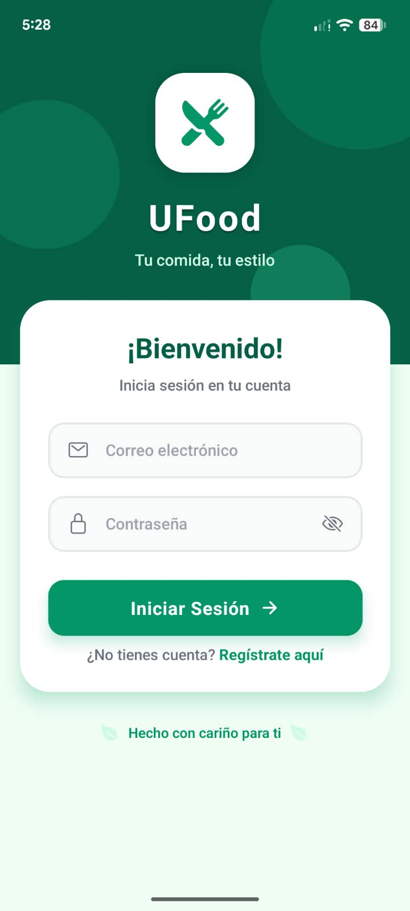<br><sub><b>Inicio de sesión</b></sub></td>
    <td align="center">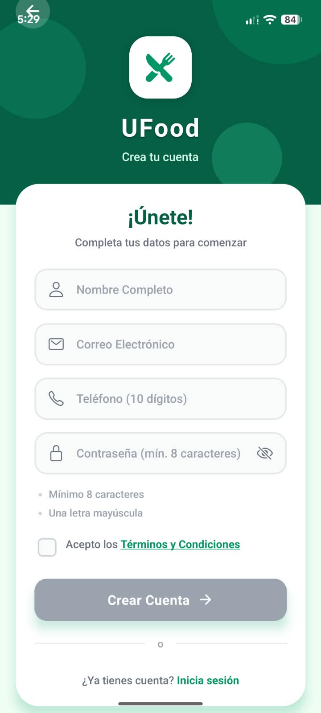<br><sub><b>Registro</b></sub></td>
    <td align="center">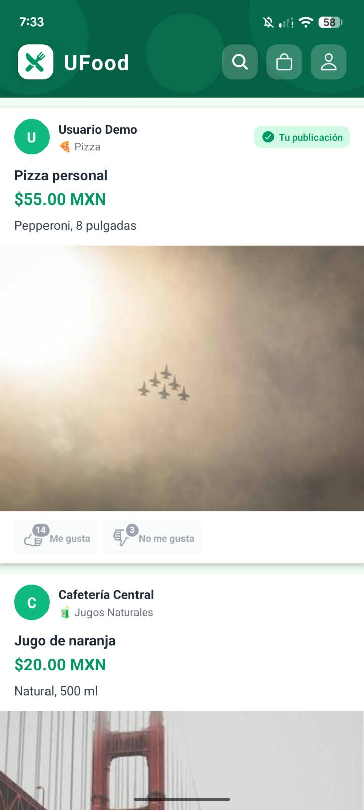<br><sub><b>Inicio</b></sub></td>
  </tr>
  <tr>
    <td align="center">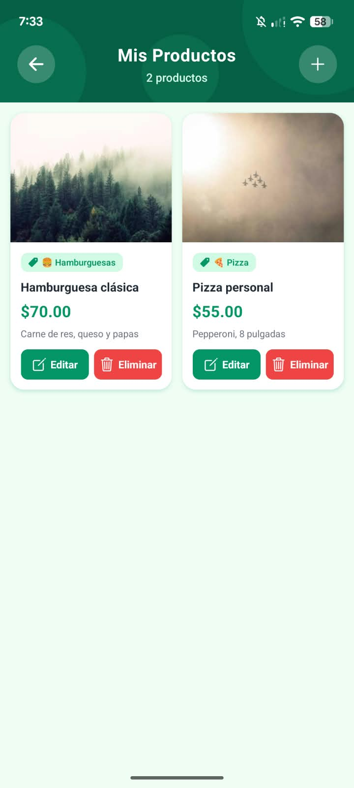<br><sub><b>Productos</b></sub></td>
    <td align="center">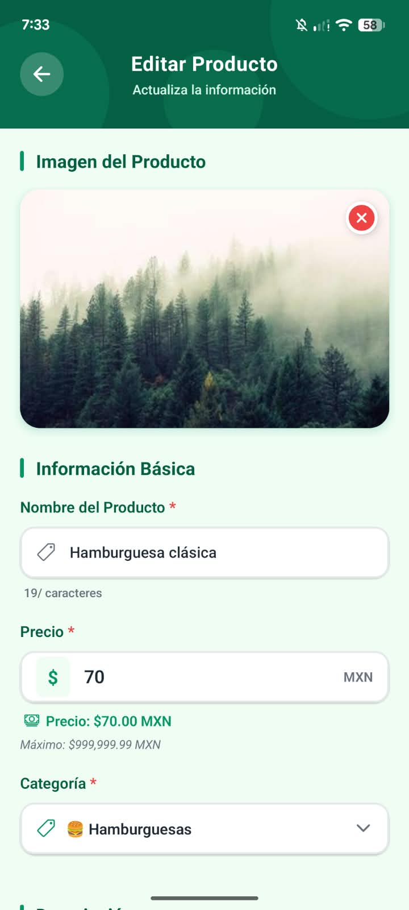<br><sub><b>Editar producto</b></sub></td>
    <td align="center">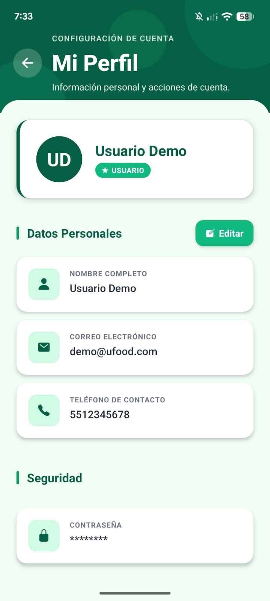<br><sub><b>Perfil</b></sub></td>
  </tr>
</table>

### Panel de administración

<table align="center">
  <tr>
    <td align="center">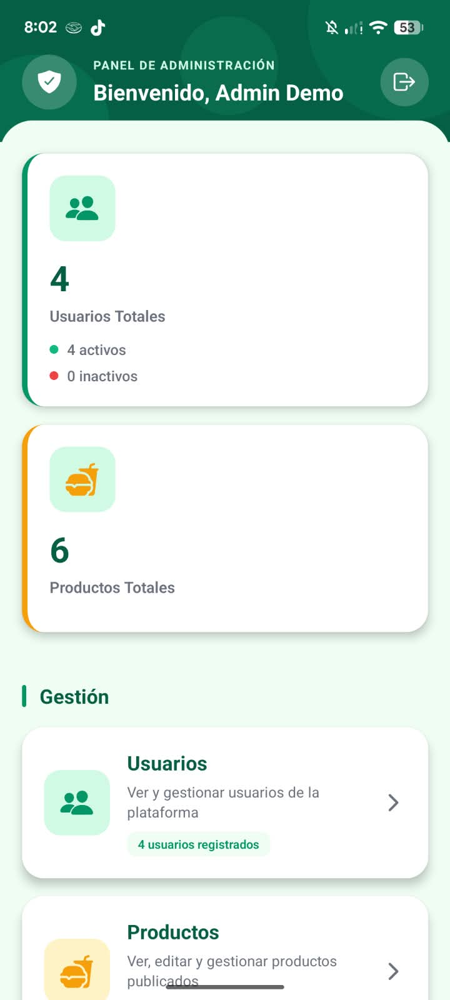<br><sub><b>Dashboard</b></sub></td>
    <td align="center">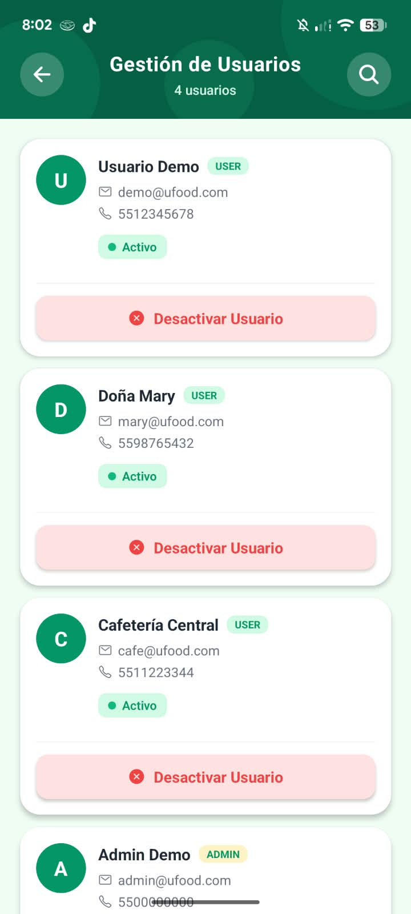<br><sub><b>Usuarios</b></sub></td>
    <td align="center">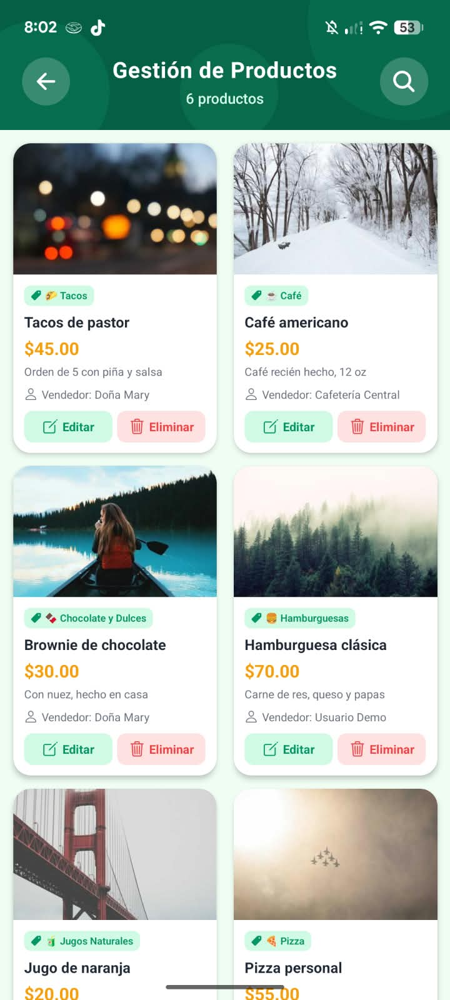<br><sub><b>Productos</b></sub></td>
  </tr>
  <tr>
    <td align="center">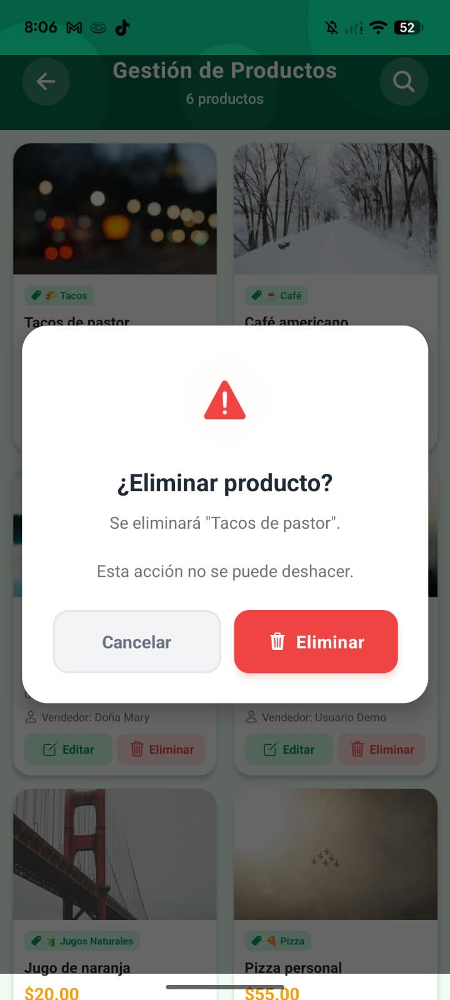<br><sub><b>Eliminar producto</b></sub></td>
    <td align="center">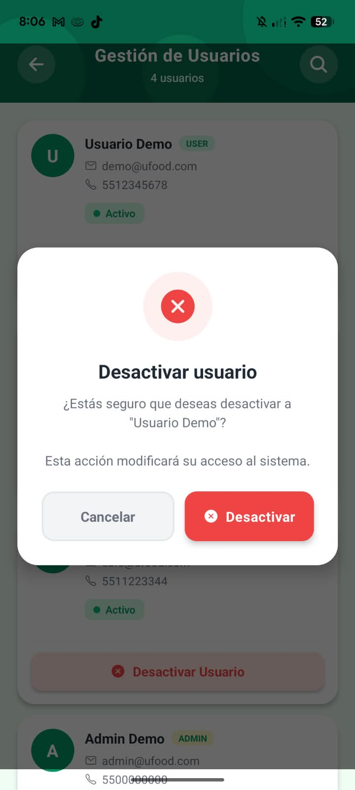<br><sub><b>Desactivar cuentas</b></sub></td>
  </tr>
</table>

---

## Funcionalidades

- **Autenticación con JWT**: registro, inicio de sesión, persistencia de sesión, expiración por inactividad, bloqueo temporal tras intentos fallidos y cierre de sesión.
- **Gestión de productos**: crear, editar, eliminar y consultar productos, incluidos los de un vendedor específico, con validación de formularios.
- **Imágenes**: selección desde cámara o galería con Expo Image Picker.
- **Búsqueda y filtrado**: por nombre, descripción, categoría y precio; ordenamiento por precio, nombre o fecha.
- **Votación**: los usuarios pueden dar like o dislike a los productos.
- **Contacto por WhatsApp**: abre una conversación directa con el vendedor del producto.
- **Perfil**: edición de datos y eliminación de cuenta.
- **Panel de administración**: dashboard con estadísticas, gestión y búsqueda de usuarios, activación/desactivación, y consulta y eliminación de productos. El acceso se controla por rol.
- **Monitoreo**: eventos de uso, errores y rendimiento HTTP enviados a Datadog.

---

## Stack tecnológico

| Capa | Tecnología |
|---|---|
| Frontend | React Native, Expo, JavaScript, React Hooks |
| Navegación y estilos | React Navigation, NativeWind |
| Red y persistencia | Fetch con interceptores propios, AsyncStorage |
| Dispositivo | Expo Image Picker, Expo StatusBar |
| Backend (equipo) | .NET, microservicios, MongoDB, JWT, Docker, Render |
| Monitoreo | Datadog |
| Build y distribución | Expo Go, EAS Build, Google Play Console |
| Diseño y control de versiones | Figma, Git, GitHub |

> El backend lo desarrollaron otros integrantes del equipo y no forma parte de este repositorio.

---

## Arquitectura

El frontend sigue el patrón **MVVM** con una capa de servicios que abstrae la API y el almacenamiento local.

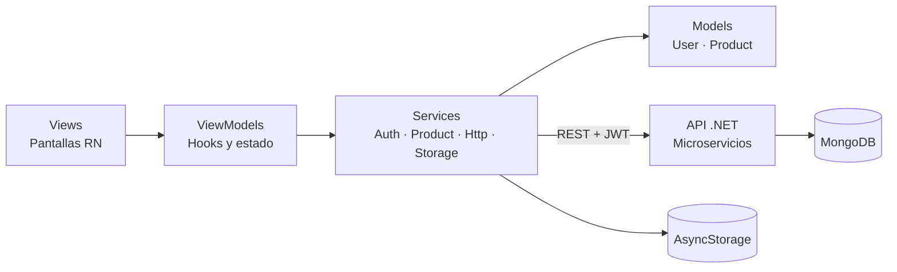

```text
UFOOD/
├── src/
│   ├── config/         # Configuración centralizada (app.config.js)
│   ├── models/         # User.model.js, Product.model.js
│   ├── services/       # Http, Auth, Product, Storage, Datadog
│   ├── viewmodels/     # Auth.viewmodel.js, Product.viewmodel.js, ...
│   ├── views/          # Pantallas (Login, Home, ProductForm, Admin*, ...)
│   ├── navigation/     # AppNavigator.js, NavigationTracker.js
│   ├── utils/          # Validaciones y formato
│   └── constants/      # Colores
├── assets/
├── docs/images/        # Capturas del README
├── App.js
├── app.json
└── ARCHITECTURE.md
```

Para el detalle de cada capa y de los patrones aplicados, consulta [ARCHITECTURE.md](./ARCHITECTURE.md).

---

## Decisiones técnicas

| Decisión | Motivo |
|---|---|
| **MVVM con hooks** | Separa la UI de la lógica de presentación y facilita probar cada capa por separado. |
| **Servicios Singleton** | `Http`, `Auth`, `Product` y `Storage` mantienen una única instancia y estado compartido consistente. |
| **Interceptores HTTP** | El token JWT se agrega automáticamente a las peticiones y la actividad de sesión se actualiza en un solo lugar. |
| **Servicios como repositorios** | Cambiar el backend solo requiere modificar la capa de servicios, sin tocar las vistas. |
| **Configuración centralizada** | URLs, claves de almacenamiento, reglas de validación y categorías viven en `app.config.js`. |
| **Control de sesión en cliente** | Expiración por inactividad (1 hora) y bloqueo temporal tras 5 intentos fallidos de inicio de sesión. |
| **Subida con FormData** | Las imágenes se envían como `multipart/form-data`, con ajustes específicos para Android. |

---

## Mi participación

Me enfoqué en el **desarrollo del frontend móvil**:

- Interfaces y componentes en React Native: pantalla principal, consulta y gestión de productos.
- Formulario de publicación de productos y validaciones.
- Búsqueda, filtrado y ordenamiento.
- Contacto con vendedores por WhatsApp e interacción/votación de productos.
- Manejo de sesión y almacenamiento local.
- Integración con los servicios REST del backend.
- Monitoreo con Datadog.
- Configuración para Android y preparación del build con Expo/EAS.
- Corrección de errores y mejoras de interfaz y experiencia de usuario.

---

## Monitoreo con Datadog

Se integró un tracker que registra el uso y el funcionamiento de la app. Fue diseñado para funcionar dentro de Expo Go.

| Categoría | Eventos |
|---|---|
| Navegación | `screen_view`, `screen_duration`, `app_started` |
| Interacción | `search_performed`, `product_interaction`, `product_voted`, `products_refreshed` |
| Contacto | `whatsapp_contact_initiated` |
| Sesión | `user_logged_in`, `user_logged_out` |
| Rendimiento | `http_request` |

---

## Instalación local

**Requisitos:** Node.js, npm y, para emulación, Android Studio. El proyecto usa **Expo SDK 54**, por lo que necesitas una versión de Expo Go compatible con ese SDK.

```bash
git clone https://github.com/AaronChavezMtz/ufood-frontend.git
cd ufood-frontend
npm install
npx expo start -c
```

También puedes usar `npm run android`, `npm run ios` o `npm run web`.

**Configuración de la API:** los endpoints están en `src/config/app.config.js`. Para usar todas las funciones necesitas una instancia activa del backend y actualizar esas URLs.

---

## Distribución

La app se preparó para Android. Durante el desarrollo se usó Expo Go, y después **EAS Build** para generar el paquete instalable. Llegó a distribuirse mediante **Google Play Console** con una prueba cerrada en dispositivos físicos.

---

## Estado actual

**Proyecto académico finalizado. Backend no disponible.**

| Componente | Estado |
|---|---|
| Código del frontend | ✅ Disponible |
| Interfaz y navegación | ✅ Funcionan |
| Prototipo de Figma | ✅ Disponible |
| Landing page | ✅ Disponible |
| Funciones que requieren la API | ⚠️ No operativas |

Para reactivar el sistema completo habría que volver a desplegar los microservicios y la base de datos, y actualizar los endpoints.

---

## Roadmap

Estas funcionalidades se plantearon durante el proyecto y **no están implementadas**:

- [ ] Sistema de pedidos dentro de la app
- [ ] Chat interno entre clientes y vendedores
- [ ] Pagos en línea
- [ ] Historial de compras y ventas
- [ ] Panel de estadísticas para vendedores
- [ ] Seguimiento de entregas por GPS
- [ ] Notificaciones push
- [ ] Validación de imágenes con IA

---

## Equipo

Proyecto académico desarrollado en equipo.

| Rol | Integrante |
|---|---|
| Frontend móvil | **Aaron Yosef Chávez Martínez** · [GitHub](https://github.com/AaronChavezMtz) |

---

## Documentación

- [ARCHITECTURE.md](./ARCHITECTURE.md): arquitectura MVVM, patrones de diseño, flujo de datos y seguridad del cliente.
- [Política de privacidad](./PRIVACY_POLICY.md)
- [Prototipo en Figma](https://www.figma.com/proto/RSHdXW03TWzHwBnlzr1H6I/Proyecto-Unifood?node-id=203-91&t=YW8KWwt7WpPUUCtV-1&scaling=scale-down&content-scaling=fixed&page-id=92%3A2089)
- [Landing page](https://matrark.github.io/ufood-landing/)

---

## Licencia

Consulta el archivo [LICENSE](./LICENSE).